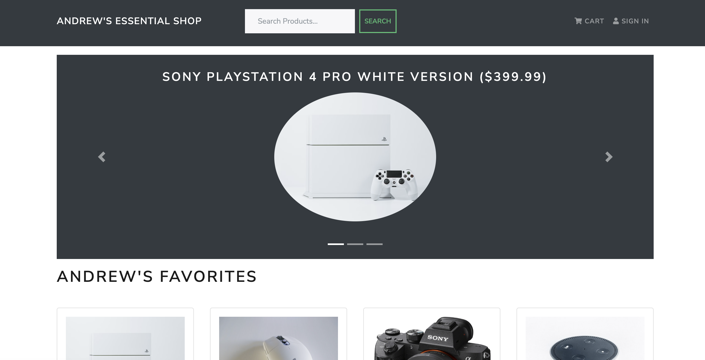
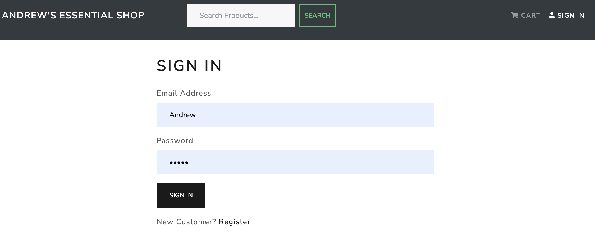
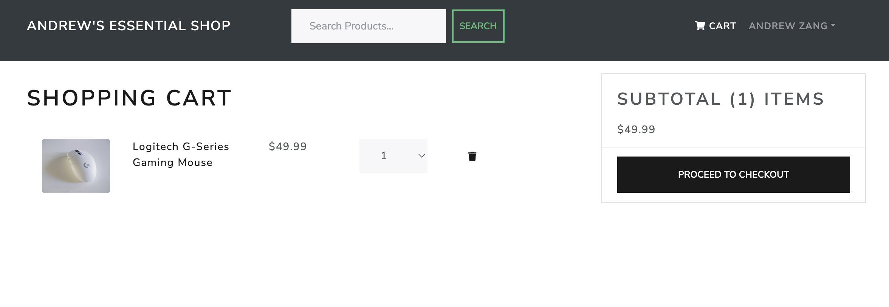
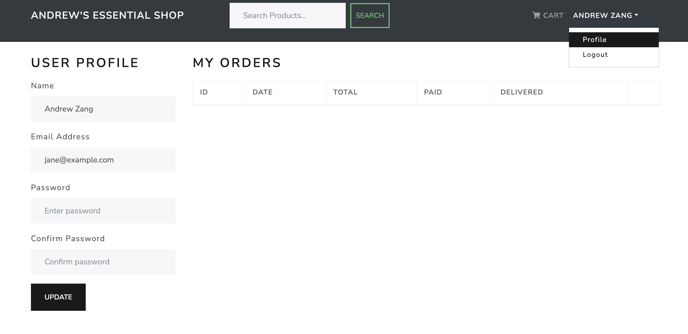
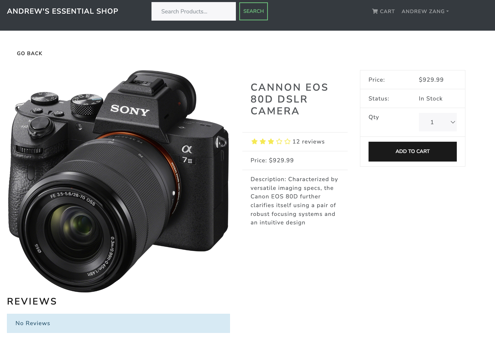
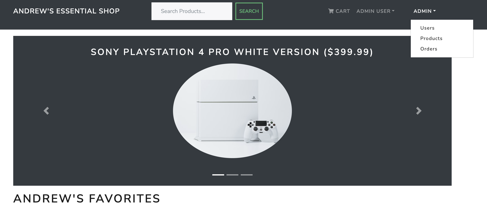
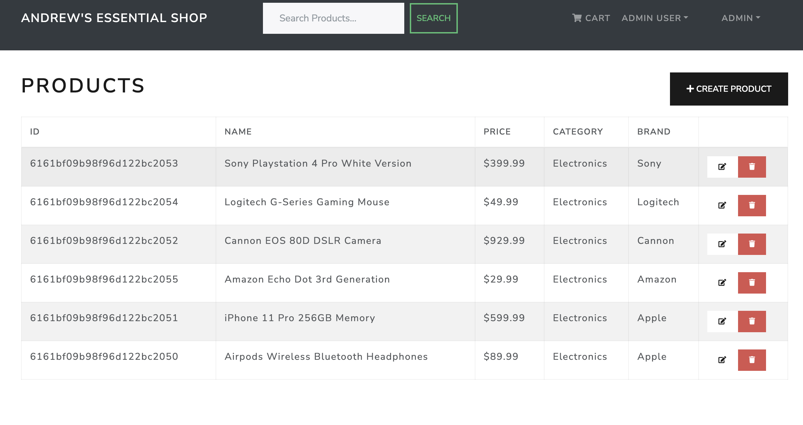
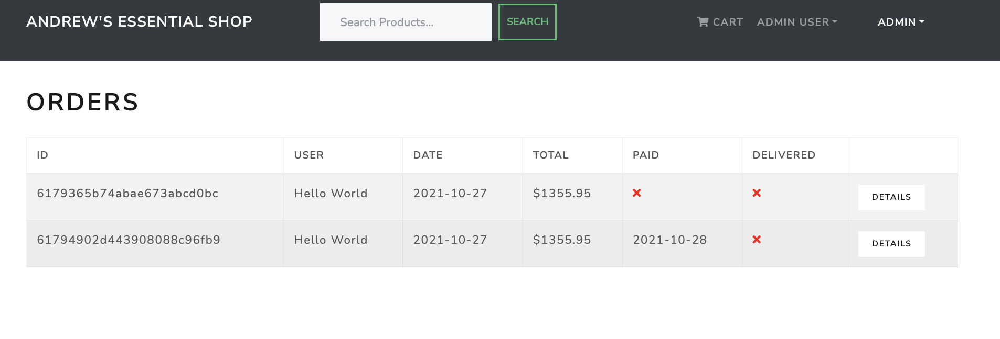
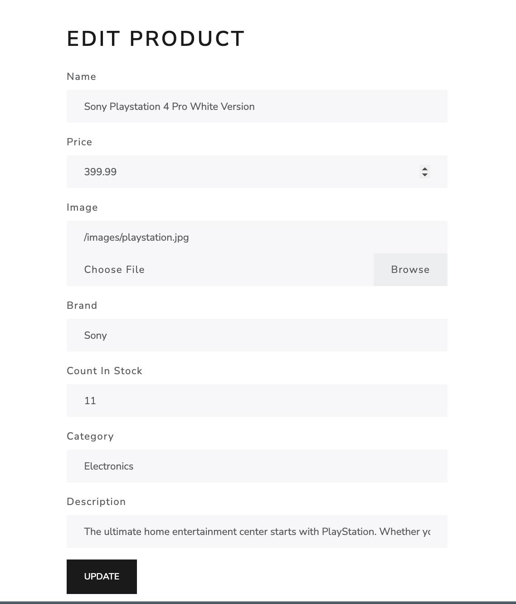

# AndrewsEssential

This is a full stack online shopping website built with the MERN (MongoDB, ExpressJS, ReactJS, NodeJS) tech stack.

It is able to accomplish all functionalities that a shopping website should have.

In addition, there are two types of users - customers and admin users.
Admin users will have control to see and delete existing users, products and process with orders submitted.

## Local Development Setup

1. Navigate to frontend folder, run `npm install`
2. Navigate back to root directory, run `npm install`
3. Make sure you have a `.env` file set up with some global variables, specifically

- MONGO_URI
- JWT_SECRET
- PAYPAL_CLIENT_ID

4. Run `npm run dev` to start local development

## UI Demo

### Customer View

Home screen view:

There are many things you can do here.

To sign in as an existing user or register for a new user, click the "SIGN IN" button on the upper-right corner and it will lead you to this page.

Note that the "CART" button nagivates to a protected page, without signing in, the button will lead to the sign in page as well.

After sign in, you can add items to cart and they will show in the cart page.

After sign in, you can also edit personal profile and see past orders

With the list of products in the home screen, you can click on one product and this will lead to a page with details of the specific product. You will be able to add a product to cart from the product page as well.

### Admin View

When logged in as Admin users, there will be different headers in the view. More specifically, there are buttons lead to users, products and orders page for admin users.

Admin users can edit exsiting users/products/orders and delete or add new ones.

